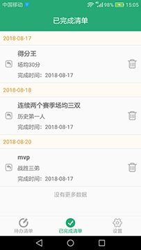
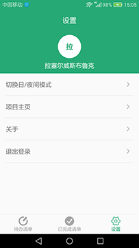
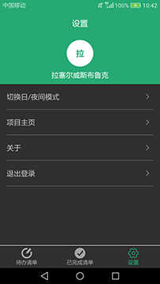

# Todo_WanAndroid
玩安卓开源的TODO工具安卓版，该工具可以帮助你合理地规划日常任务

## 1.项目说明

此项目为鸿洋大神WanAndroid网站[TODO工具](http://wanandroid.com/lg/todo/list/0)的安卓版，采用Java编写，项目采用MVP+Retrofit+RxJava框架。

## 2.Apk下载

[点击下载](https://fir.im/1mgz)

## 3.功能描述

**登录、注册**

**添加待办清单**

**查询待办、已完成清单**

**删除清单**

**更新清单状态**

**切换夜间模式**

## 4.相关技术

**MVP+Retrofit+RxJava**

## 5.项目截图

 

 

 

 

 

## 6.致谢

鸿洋大神提供的[Todo清单管理 开放API](http://www.wanandroid.com/blog/show/2#30)接口
